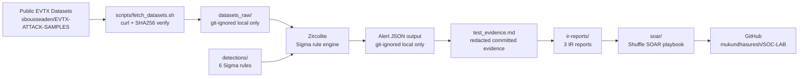

# Architecture — Detection Engineering Pipeline

## Component Descriptions

**fetch_datasets.sh** — Downloads pre-recorded MITRE ATT&CK attack telemetry from
public security research repos. Files are SHA256-verified and stored locally only
(git-ignored). Run this first to reproduce the detection pipeline.

**Sigma Rules** — 6 custom detection rules covering credential access, lateral
movement, execution, defense evasion, and privilege escalation. Written to match
actual EVTX field schemas confirmed by inspection.

**Zircolite** — Standalone Python tool that runs Sigma rules directly against EVTX
files without a SIEM server. All 6 rules produced confirmed true positive alerts.

**test_evidence.md** — Per-technique evidence files containing redacted alert output,
detection logic explanation, and analyst verdict. No personal or system-identifying
information committed.

**IR Reports** — 3 full incident response reports (IR-001, IR-002, IR-003) with
timeline, IOCs, root cause, containment steps, and lessons learned.

**SOAR Playbook** — Shuffle workflow JSON for automated Pass-the-Hash containment:
IP enrichment via VirusTotal → SOC notification → account disable → audit log.
